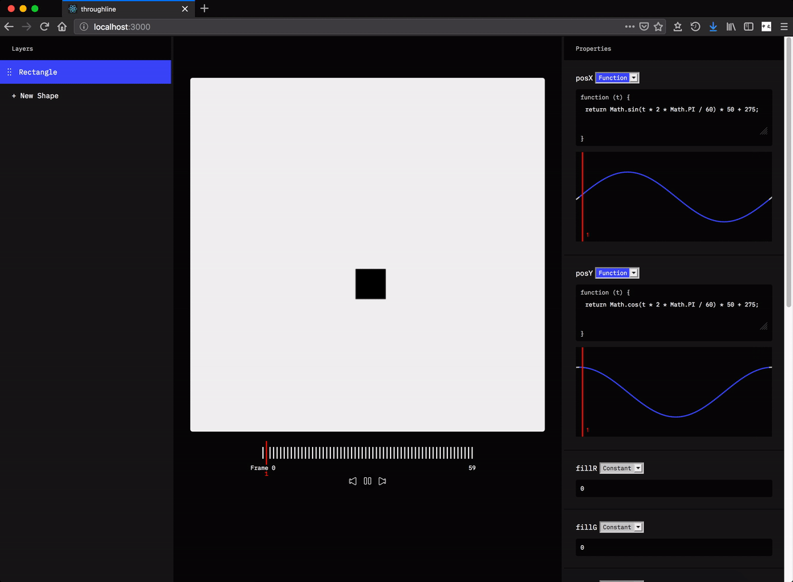
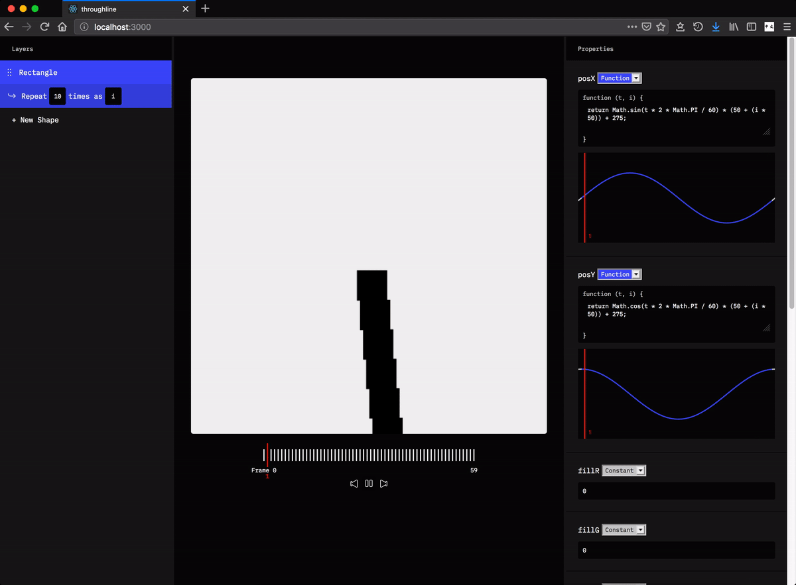

# Throughline

Throughline is a web app that explores an idea I had about a functional approach for creating looping gifs like those made by Twitter user [@beesandbombs](https://twitter.com/beesandbombs) and [Just van Rossum](https://twitter.com/justvanrossum).

## How does Throughline work?

While other creative coding apps like [Drawbot](http://www.drawbot.com/) or [Processing](https://processing.org/) have users draw by writing imperative programs, in Throughline users draw by specifying how the attributes of a given shape change as a function of time (and potentially other parameters). This means that if I wanted to draw a square which moves along the circumference of a circle with a radius of 50 pixels and centered at the point (275, 275), I could do that by defining that square's x-coordinate and y-coordinate in two functions:

```js
function posX(t /* Where t = [0, 59]*/) {
  return Math.sin(t * 2 * Math.PI / 60) * 50 + 275;
}

function posY(t) {
  return Math.cos(t * 2 * Math.PI / 60) * 50 + 275;
}
```



This same approach can be used to animate the square in other ways: we could also use functions to define the values for its width, height, background color, etc.

If you wanted to draw, say, ten squares moving in a circle, each of which has an orbit longer than the last, it would be pretty tedious to have to make ten shapes and then copy and paste the same function but with slight tweaks each time (and it would be much more tedious if you wanted to go back and change anything). To make this easier, you can attach *repeaters* to your shapes by clicking the button in your shape layer that looks like a "repeat" icon. Repeaters give you access to an additional variable which represents the loop index of that shape. With the repeater, you can change your functions to:

```js
function posX(t /* Where t = [0, 59]*/, i /* Where i = [0, 9] */) {
  return Math.sin(t * 2 * Math.PI / 60) * (50 + (i * 50)) + 275;
}

function posY(t) {
  return Math.cos(t * 2 * Math.PI / 60) * (50 + (i * 50)) + 275;
}
```



This will draw 10 squares, each of which is moving in a circle, where the first square's circle has radius 250, the second 300, the third 350, and so on. You can change the name and specify the range of the repeater variable (and you can even have repeaters on repeaters).

## Project status

I had to idea for this project around Spring 2018, and since then I've worked on it on and off, mostly because I thought it might turn out pretty cool and also because it was fun to think about/engineer/design for some of these problems. This meant that I mostly worked on the parts that I wanted to work on at the time, which resulted in this project coming out as something of a patchily polished turd. Everything's kind of half-finished: I designed some icons but not all of them, some parts are still unstyled, some functionality which would make this a lot more usable aren't included, etc. This is partly because 1) I've been busy and 2a) I got achieved what I considered to be an MVP and then 2b) the limitations of this approach to creative coding seemed to outweigh the benefits any extra work would have.

Throughline's biggest limitation is that it doesn't allow you to specify an order of operations. This matters when you're drawing because some actions are non-transitive: rotating the canvas and then translating a shape has a different outcome than translating a shape and then rotating the canvas. In Throughline, though, there isn't a way to do that, which means that there's an entire class of animations which just aren't possible to draw. I haven't been able to come up with a solution that fits well with Throughline's mental model.

That said, if you find this project interesting and would like to talk about it or what it could be, please feel free to reach out! I'd love to hear what you think or about your ideas for alternative methods for creative coding.

## Outstanding tasks

The following is a non-exhaustive list of things I think would make the app a lot better (roughly in the order of how useful it would be):

- [ ] come up with some way for users to easily export/import projects (e.g. an option to download some of the app state as JSON and upload it again)
- [ ] allow users to move layers up/down by clicking and dragging
- [ ] show values in the graph as you hover over different frames
- [ ] syntax highlighting in the function editor
- [ ] controls for more stuff (e.g. canvas size, number of frames)
- [ ] come up with a better name than "Throughline" (which sucks)